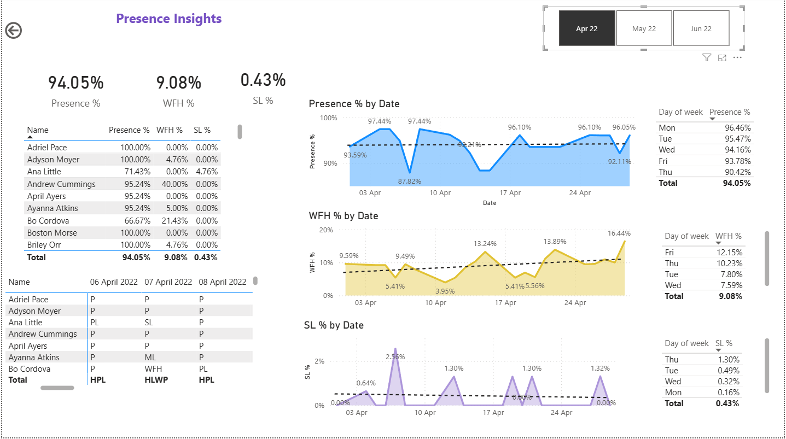

# HR Analytics Power BI Dashboard

## 🛠 Tools Used
Power BI | Excel

## 📋 Problem Statement
HR team needed a way to monitor employee attendance, 
Work From Home trends and Sick Leave patterns across 
the organization for Apr-Jun 2022.

## 📊 Dashboard Overview

## 🔍 Key Insights
- Overall Presence: 91.83%
- Overall WFH: 10.00%
- Overall Sick Leave: 1.10%
- Monday has highest presence rate (93.21%)
- Friday has highest WFH rate (13.01%)
- WFH trend is increasing over time

## 📁 Files
- HR_Analytics.pbix - Power BI Dashboard file
- Attendance-Sheet-2022-2023.xlsx - Raw data
